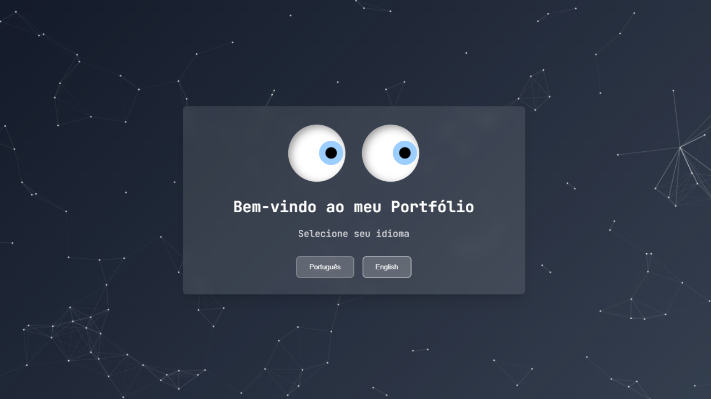
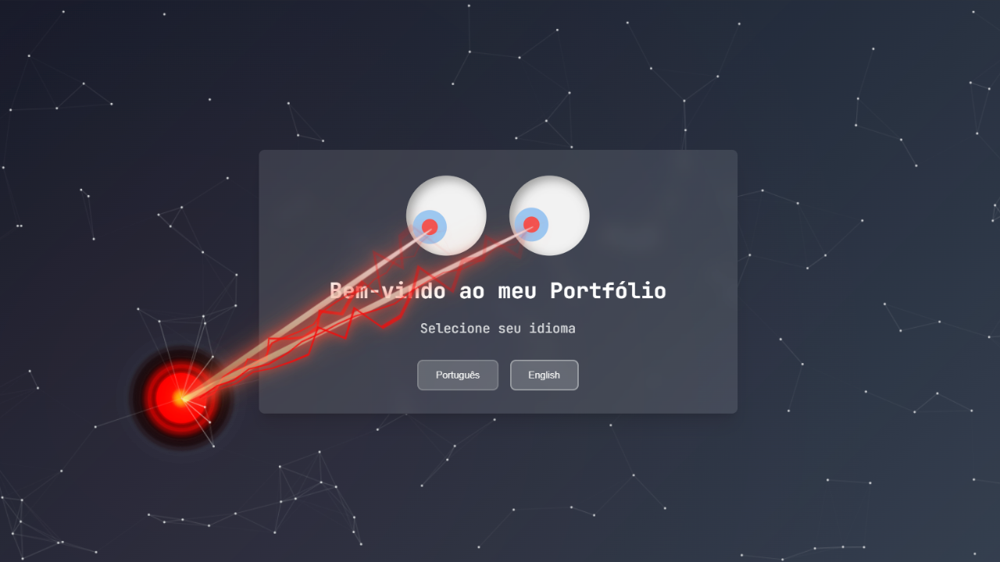
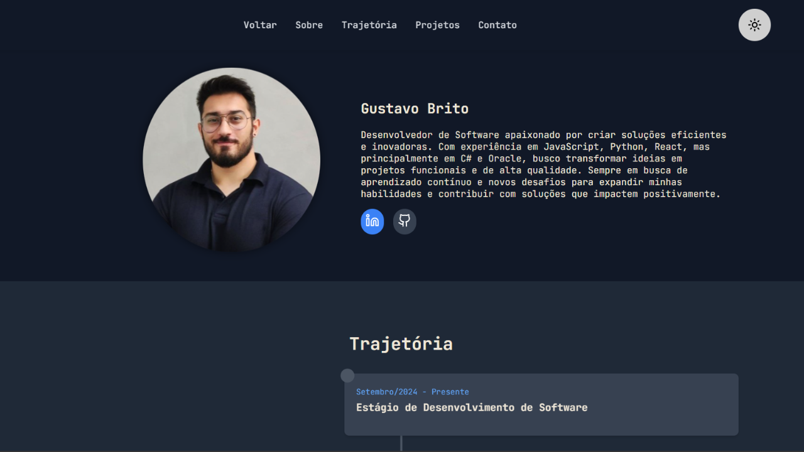
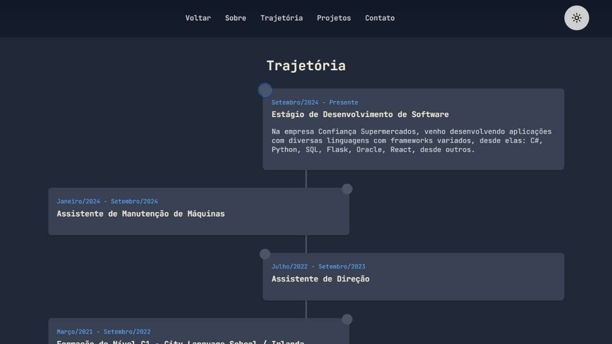
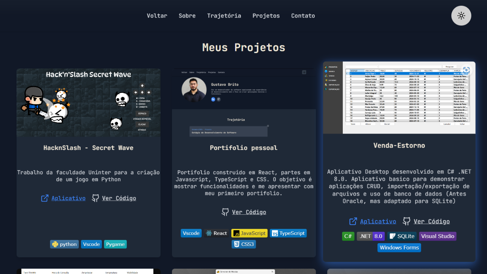
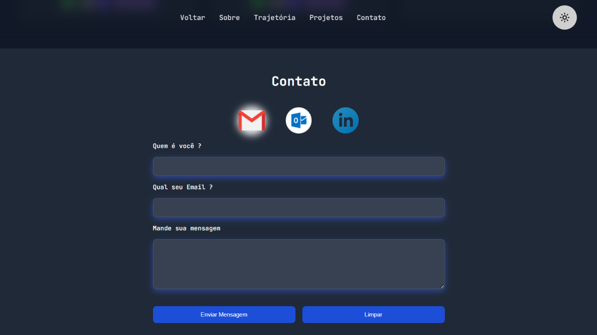

<h1 align="center">
   🚀 Portfólio Interativo com React, TypeScript e Framer Motion
</h1>
Este é um portfólio pessoal, totalmente interativo e responsivo, criado seguindo as melhores práticas com React e TypeScript. A interface proporciona uma experiência visual marcante, com animações dinâmicas geradas pelo Framer Motion, além de um sistema de tema claro/escuro persistente via localStorage.

<h2 align="center">
 ✨ Principais Funcionalidades:
</h2>

🌐 Navegação suave entre as seções (about, timeline, projects, contact), garantindo acessibilidade e uma experiência consistente.

🎨 Alternância entre tema claro e escuro, com persistência automática usando localStorage.

🌍 Suporte multilíngue (Português e Inglês) implementado com react-i18next.

🔁 Animação de flip no avatar estilo LEGO, criada com motion.div do Framer Motion.

📁 Arquitetura modular: cada seção isolada em componentes .tsx e .css, facilitando manutenção e escalabilidade.

📌 Layout adaptativo com um menu inteligente no formato 3x2, ideal para dispositivos móveis.

💼 Integração direta com perfis no LinkedIn e GitHub.

🧩 Imagens otimizadas utilizando loading="lazy" para melhorar a performance.

💥 Efeitos especiais, como um laser saindo dos olhos, que adicionam personalidade ao projeto.

<h2 align="center">
 🖼️ Visual do Projeto
</h2>

O portfólio inclui:

Tela inicial com olhos interativos que seguem o cursor e disparam laser.

Seção "Sobre" com avatar animado e detalhes de perfil.

Linha do tempo profissional dinâmica, mostrando a trajetória.

Galeria de projetos destacados, com links para aplicação e código-fonte.

Formulário de contato funcional, com estilo alinhado às redes sociais.

<h2 align="center">
 🖼️ Galeria
</h2>

### Tela Inicial / Efeito Laser

### Sobre

### Timeline

### Projetos

### Contato

<h2 align="center">
🛠️ Tecnologias Utilizadas:
</h2>

React

TypeScript

Framer Motion

React-i18next

CSS Modules

LocalStorage

GitHub Pages (para deploy)

<h2 align="center">
✅ Organização
</h2>

O repositório foi estruturado com foco em:

Tipagem forte, garantindo segurança no desenvolvimento.

Boas práticas de código, com clara separação de responsabilidades.

Escalabilidade, permitindo fácil adição de novas seções ou funcionalidades.

